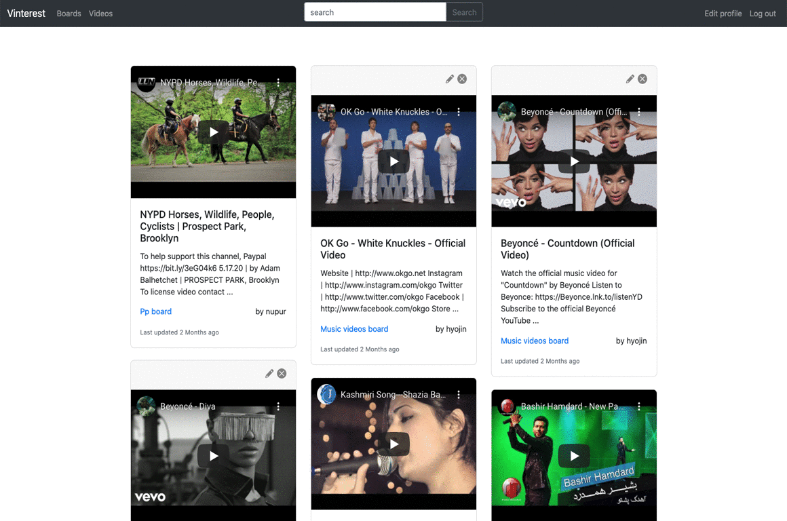

# Vinterest 
A Pinterest-inspired web application that enables users to pin their favorite videos cross-platform, including Youtube and Vimeo. Built with Ruby On Rails, SQL, YouTube API, and Bootstrap.

[Live @vinterest.herokuapp.com](https://vinterest.herokuapp.com/) ID: demo PW: demo
 

### Functionality ###

Vinterest allows a user to:
* Sign up and create an account.
* Edit their account details.
* Add video links, edit video information, and delete video.
* View the video uploaded of other users.
* Create boards and set it to public or secret.
* Search for videos and save it to user's board.

### Built With ###
* Ruby On Rails
* SQL
* YouTube API
* Bootstrap

### Features ###
* Automatic videoURL change from shared link to embbed video format for Vimeo and YouTube
* YouTube video search by title
* Masonary grid with Bootstrap

### Resources used ###
* [Figma](https://www.figma.com/) - Creating mockups/prototypes for site layout and design
* [YouTube API](https://developers.google.com/youtube/v3) - Fetch search result by video titles
* [Bootstrap](https://getbootstrap.com/) - Masonary grid and responsive design
* [FontAwesome](FontAwesome) - Icons for edit, delete, secret and public

