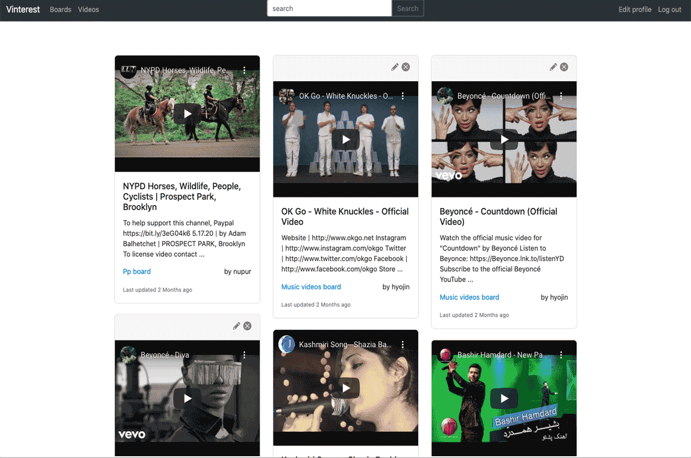

# Vinterest #
by [Hyojin](https://github.com/jinnic)

[Live @vinterest.herokuapp.com](https://vinterest.herokuapp.com/) ID: demo PW: demo

### About ###

Pinterest inspired video sharing social media web
application. Utilized YouTube API for searching videos
and wrote a custom library that can format shared
YouTube and Vimeo links to it’s embedded link.

Vinterest allows a user to:
* Sign up and create an account.
* Edit their account details.
* Add video links, edit video information, and delete video.
* View the video uploaded of other users.
* Create boards and set it to public or secret.
* Search for videos and save it to user's board.

### Built With ###
* Ruby On Rails, SQL, YouTube API, Bootstrap

### Features ###
* Automatic videoURL change from shared link to embbed video format for Vimeo and YouTube
* YouTube video search by title
* Masonary grid with Bootstrap

### Resources used ###
* [Figma](https://www.figma.com/) - Creating mockups/prototypes for site layout and design
* [YouTube API](https://developers.google.com/youtube/v3) - Fetch search result by video titles
* [Bootstrap](https://getbootstrap.com/) - Masonary grid and responsive design
* [FontAwesome](FontAwesome) - Icons for edit, delete, secret and public

